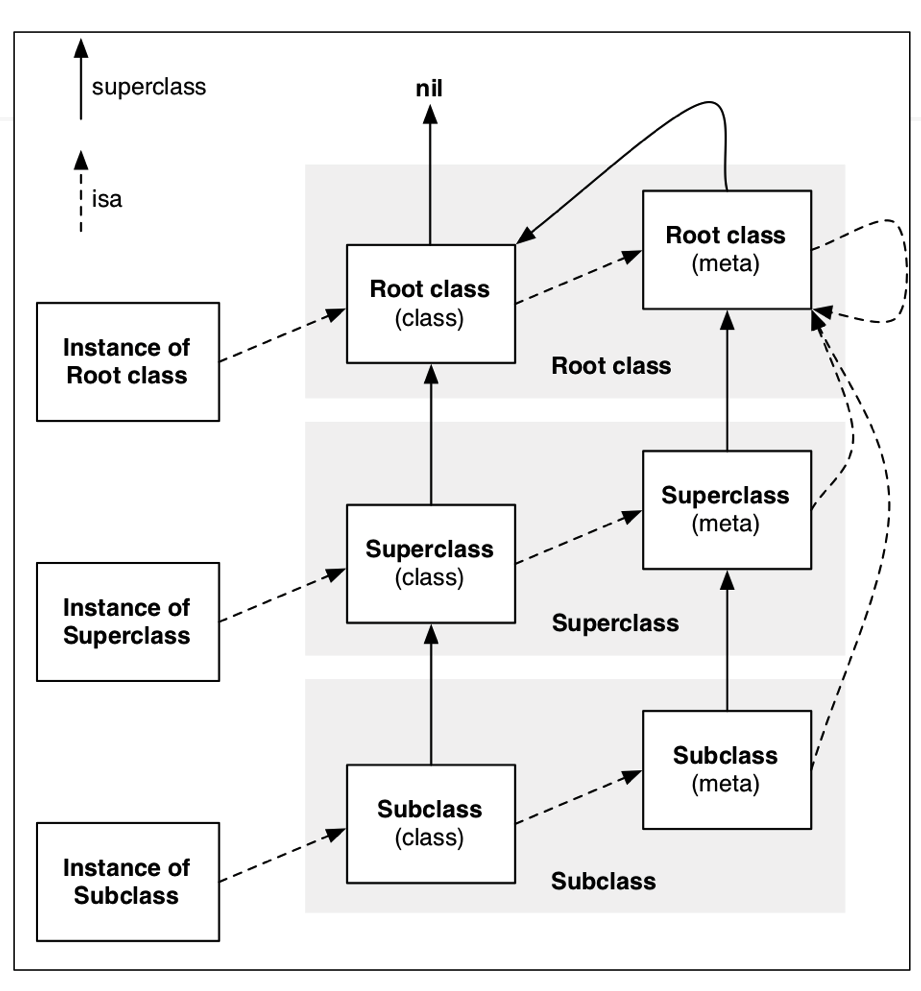

# OC对象本质

### oc对象在内存中布局

我们平时编写的代码oc代码，底层都是c/c++实现的,oc的对象、类主要是基于c\c++的**结构体**实现的
在以前是`oc -> c\c++ -> 汇编语言 -> 机器语言`

#### oc转c++

```
重写oc代码为c++代码
clang -rewrite-objc main.m -o main.cpp  
//指定平台及架构
xcrun -sdk iphoneos clang -arch arm64 -rewrite-objc main.m -o main-arm64.cpp
如果要链接其它框架，使用-framework参数，如-framework UIKit
// 不同平台支持的代码是不一样
// Windows、mac、iOS
// 模拟器(i386)、32bit(armv7)、64bit（arm64）
```

#### NSObjcet对象转为c++

```
typedef struct objc_class *Class;
struct NSObject_IMPL {
	Class isa;//8字节
};

struct objc_class {
    Class _Nonnull isa  OBJC_ISA_AVAILABILITY;
};
Class为结构体指针objc_class*,其中含有一个指针is，指向objc_class类型
```

#### 一个Person对象转c++

```
struct Person_IMPL {
	struct NSObject_IMPL NSObject_IVARS;
	int _no;
	int _age;
	int _height;
};
简化后即
struct Person_IMPL {
	Class isa;//8字节
	int _no;//4
	int _age;//4
    int _height;//4
};//至少需要24（class_getInstanceSize）字节，实际分配了32(malloc_size)字节

把一个person对象转成指向Person_IMPL结构体的指针
struct Person_IMPL *p = (__bridge struct Person_IMPL*)person;
```

**成员变量所占内存空间即为所有成员变量考虑内存对齐之后的总和**
**malloc_size返回大小在oc中一般为16的倍数,这操作系统内存分配对齐，与结构体内存对齐不一样**
**GNU也类似如此**

```
void *obj = calloc(1, 24);
NSLog(@"%zu",malloc_size(obj));
//结果32,这个和系统有关,在oc中一般是16的倍数
#define NANO_MAX_SIZE			256 /* Buckets sized {16, 32, 48, ..., 256} */

libmalloc中源码比较，有calloc/malloc_size实现　难以读懂

void * calloc(size_t num_items, size_t size)
{
	void *retval;
	retval = malloc_zone_calloc(default_zone, num_items, size);
	if (retval == NULL) {
		errno = ENOMEM;
	}
	return retval;
}

void * malloc_zone_calloc(malloc_zone_t *zone, size_t num_items, size_t size)
{
	MALLOC_TRACE(TRACE_calloc | DBG_FUNC_START, (uintptr_t)zone, num_items, size, 0);

	void *ptr;
	if (malloc_check_start && (malloc_check_counter++ >= malloc_check_start)) {
		internal_check();
	}

	ptr = zone->calloc(zone, num_items, size);
	
	if (malloc_logger) {
		malloc_logger(MALLOC_LOG_TYPE_ALLOCATE | MALLOC_LOG_TYPE_HAS_ZONE | MALLOC_LOG_TYPE_CLEARED, (uintptr_t)zone,
				(uintptr_t)(num_items * size), 0, (uintptr_t)ptr, 0);
	}

	MALLOC_TRACE(TRACE_calloc | DBG_FUNC_END, (uintptr_t)zone, num_items, size, (uintptr_t)ptr);
	return ptr;
}
```

#### 查看内存所占字节两个关键函数

* 创建一个实例对象，至少需要多少内存？

  ```
  #import <objc/runtime.h>
  class_getInstanceSize([NSObject class]);
  ```

* 创建一个实例对象，实际上分配了多少内存？

  ```
  #import <malloc/malloc.h>
  malloc_size((__bridge const void *)obj);
  ```

  


### OC对象的分类

1. **instance对象（实例对象）**

   通过类alloc出来的对象，类每次调用alloc都会产生新的instance对象

   instance对象在内存中存储信息

    	1. isa指针
    	2. 其他成员变量

2. **class对象（类对象）**　一个类的类对象只有一个
   类对象在内存中存储信息

   * isa指针
   * superclass指针
   * 类的属性(@property)信息、类的对象方法(instance method)信息
   * 类的协议(protocol)信息、类的成员变量(IVar)信息

3. **meta-class对象（元类对象）**　一个类的元类对象只有一个
   注　meta-data元数据：描述数据的数据
   **元类对象获取方法:**　objc_getClass(传入类对象)
   元类对象在内存中存储信息

   * isa指针
   * superclass指针
   * 类的类方法信息
   * ......

#### isa superclass



1. instance对象的isa指向class
   当调用对象方法时，通过instance的isa找到class，最后找到对象方法的实现进行调用
2. class对象的isa指向meta-class
   当调用类方法时，通过class的isa找到meta-class，最后找到类方法的实现进行调用
3. class的superclass指向父类的class，如果没有父类则superclass指针为nil
4. meta-class的superclass指向父类的meta-class,**基类meta-class的isa指向基类class**
5. **meta-class的isa指向基类的meta-class**

方法调用:

1. 当子类的instance对象要调用父类的对象方法时，会先通过isa找到子类的class，然后通过superclass找到父类的class，最后找到对象方法的实现进行调用
2. 当子类的class要调用父类的类方法时，会先通过isa找到子类的meta-class，然后通过当前元类对象superclass找到父类的meta-class，最后找到类方法的实现进行调用，


#### isa本质

**从64bit开始，isa需要进行一次位运算，才能计算出实际地址值**

```
# if __arm64__
#   define ISA_MASK        0x0000000ffffffff8ULL
# elif __x86_64__
#   define ISA_MASK        0x00007ffffffffff8ULL
# else
#   error unknown architecture for packed isa
# endif

inline Class objc_object::ISA() 
{
    assert(!isTaggedPointer()); 
//精简之后
    return (Class)(isa.bits & ISA_MASK);
}

objc 源码中代码
```

如：NSObject Instance对象isa　＆ ISA_MASK之后得到NSObject　class对象地址值

```
(lldb) p/x obj->isa
(Class) $0 = 0x001dffffae577141 NSObject
(lldb) p/x 0x001dffffae577141 & 0x00007ffffffffff8ULL
(unsigned long long) $1 = 0x00007fffae577140
(lldb) p/x [NSObject class]
(Class) $2 = 0x00007fffae577140 NSObject
```


HLClassInfo.使用注意点

1. **`HLClassInfo.h`中使用大量c++语法，帮在`main.m`中使用时需要改为`main.mm`使支持c++代码**


#### union(共用体)与位域结合使用

**注意：`#define HLOneMask (1<<0)` 与　`char one:1;`对应,这样如果用`_options.one`取值不会取错，如果完全不使用`_options.one`,可以不对应**
**其次注意符号位，`char one::1;` 一位，取值时容易取成－1**，可以设置2位来避免　

```
#define HLOneMask (1<<0)
#define HLTwoMask (1<<1)
#define HLThreeMask (1<<2)
#define HLFourMask (1<<3)

union {
      int bits;
      struct {
          char one:1;
          char two:1;
          char three:1;
          char four:1;
      };
  } _options;
```

取值注意符号位

```
-(BOOL)isOne {
//    return _options.one;
    return !!(_options.bits & HLOneMask);
}
```


### 练习题

1. 一个NSObject对象占用多少内存？

2. 对象的isa指针指向哪里？

3. OC的类信息存放在哪里？

4. 下面输入什么，为什么？

   ```
   @interface NSObject(zhl)
   //+ (void)test;
   @end
   @implementation NSObject(zhl)
   - (void)test{
       NSLog(@"%s-%@",__func__,self);
   }
   @end
   @interface Person : NSObject
   @end
   @implementation Person
   @end
   
   [Person test];//person元类对象没有test方法，然后通过superClass去NSObject的元类对象
   [NSObject test];//person.metaClass 找test方法，找不到去superclass　即NSObject的类对象找，有调用成功
   
   ```

   


[附苹果源码地址](https://opensource.apple.com/tarballs/)